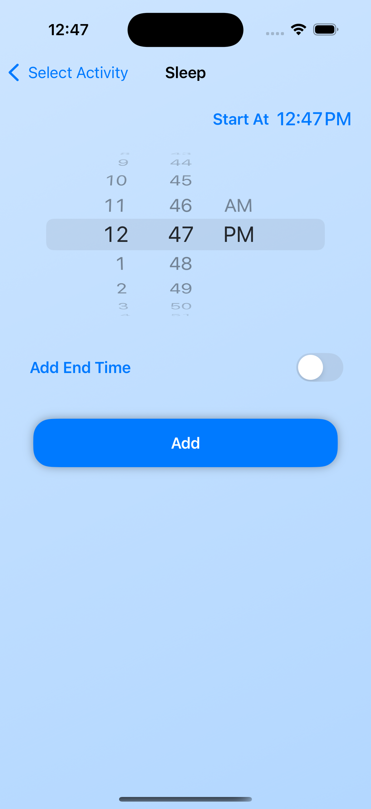

# Bjay - Baby Activity Tracker

A modern, intuitive iOS app for tracking your baby's daily activities including feeding, sleeping, and diaper changes.

## Features

- 👶 Track multiple types of baby activities:
  - Feeding (amount and duration)
  - Sleep (start and end times)
  - Diaper changes (wet, dirty, or mixed)
- 📊 Dashboard with activity history and quick stats
- ⏰ Smart feeding schedule suggestions
- 🔄 Real-time activity tracking
- 🎨 Beautiful, intuitive UI with smooth animations
- 🌙 Dark mode support

## Screenshots

|  |  |  |  |  |
|----------------------------------|--------------------------------|-----------------------------|-----------------------------|------------------------------|
| Dashboard                        | Activity Selection            | Feed Tracking               | Sleep Tracking              | Diaper Change               |

## Requirements

- iOS 15.0+
- Xcode 14.0+
- Swift 5.5+

## Installation

1. Clone the repository:

```bash
git clone https://github.com/yourusername/bjay.git
```

2. Open `Bjay.xcodeproj` in Xcode

3. Configure your development team and bundle identifier

4. Build and run the project

## Configuration

The app uses a configuration file for managing environment-specific settings. To configure:

1. Create a `Config.xcconfig` file based on the template
2. Set your `ACCOUNT_ID` and `BASE_URL` values
3. Update other configuration parameters as needed

## Architecture

Bjay follows the MVVM (Model-View-ViewModel) architecture pattern with Coordinators for navigation. The project is structured as follows:

### Core Components

- **Models**: Data structures representing activities and their metadata
- **ViewModels**: Business logic and state management
- **Views**: SwiftUI views for the user interface
- **Coordinators**: Navigation and flow management
- **Repositories**: Data management and caching
- **Services**: Network communication and API integration

### Key Design Patterns

- Repository Pattern for data management
- Coordinator Pattern for navigation
- Protocol-oriented programming
- Dependency injection

## Project Structure

```
Bjay/
├── App/
│   ├── BjayApp.swift
│   └── Config.swift
├── Models/
│   ├── Activity.swift
│   ├── ActivityType.swift
│   └── ...
├── ViewModels/
│   ├── DashboardViewModel.swift
│   ├── FeedViewModel.swift
│   └── ...
├── Views/
│   ├── Dashboard/
│   ├── Feed/
│   ├── Sleep/
│   └── Diaper/
├── Coordinators/
│   └── NavigationCoordinator.swift
├── Repositories/
│   └── ActivityRepository.swift
├── Services/
│   └── ActivityService.swift
└── Common/
    ├── Components/
    └── Utilities/
```

## Network Layer

The app uses a custom networking layer built on top of URLSession with the following features:

- Automatic JSON encoding/decoding
- Custom date formatting
- Error handling
- Request/response logging

### Backend Server

The server code is available in my other repository:
➡️ [bjay-backend](https://github.com/rjxby/bjay-backend)

### Setup Instructions

To run the application, follow these steps:

1. **Create an account** on the backend server.
2. Set the `ACCOUNT_ID` variable to your account ID.
3. Update the `BASE_URL` variable with the host of the backend, for example: `BASE_URL = http://host/api`

## License

This project is licensed under the MIT License - see the [LICENSE](LICENSE) file for details.
